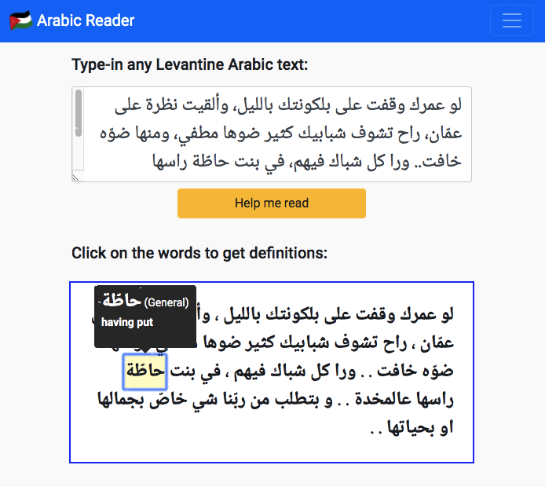

# What is Arabic Reader?
Arabic Reader is a Web app that help Arabic dialect learners to be able to easily study text and articles written in dialect Arabic. This app is designed for the Arabic Levantine dialect, spoken in Jordan and Palestine. Altougth, it may also work for dialect Arabic spoken in Lebanon and Syria.

# Running Arabic Reader Locally on Your Computer
- Make sure to have Node installed. If not, visit https://nodejs.org
- Download this repository from GitHub
- Within the donwloaded directory, execute `npm install`
- To start the web app, execute `npm start`
- Open the browser, then visit the URL ` http://localhost:3000`

**Note:** This project is a work in progress
